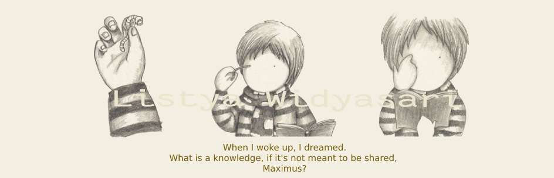
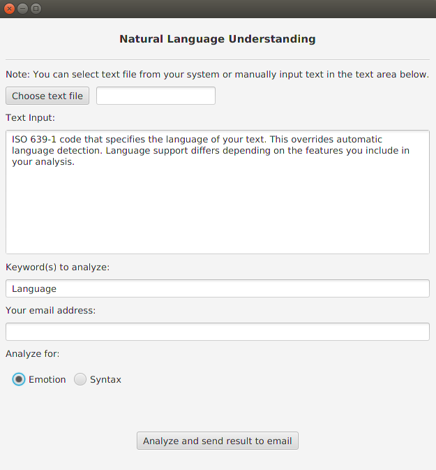
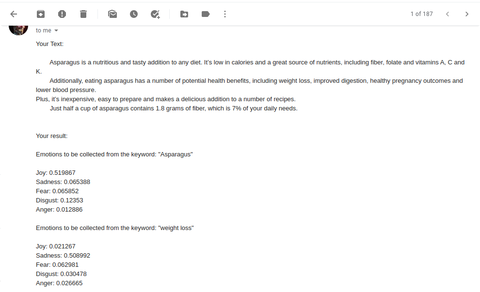

<h1>Natural Language Understanding</h1>

An app that analyzes text and retrieves the result via IBM Watson API and send the message via Gmail API after email address have been validated by
Mailbox API. Main class is the launcher, while the process of analyzing the text happens in class Process. Class Process is integrated within class GUI.

  
<h3>Image</h3>

The Gui image will look like this: 

 

 

The Email received will simply look like this: 

 

  

<h3>Future advancement</h3>
<ul>
<li>Email sent for Syntax result is set in a tidy table so its readable, right now its only String</li>
<li>GUI has option to show result on it instead of email</li>
<li>Convert project to Web App project with Spring Boot</li>
</ul>

